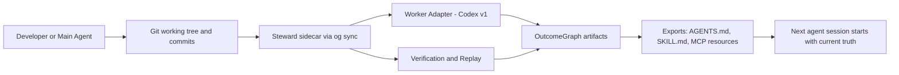
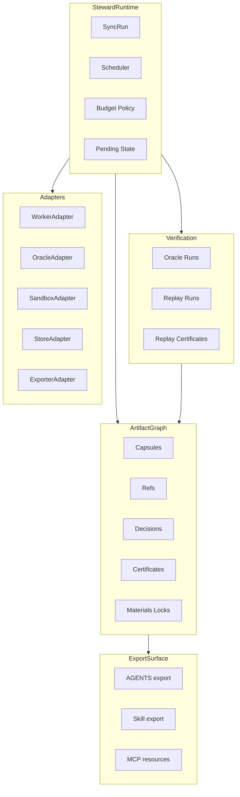
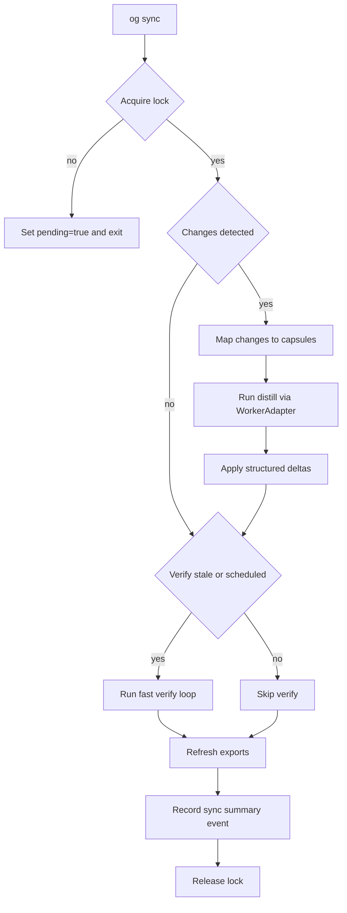
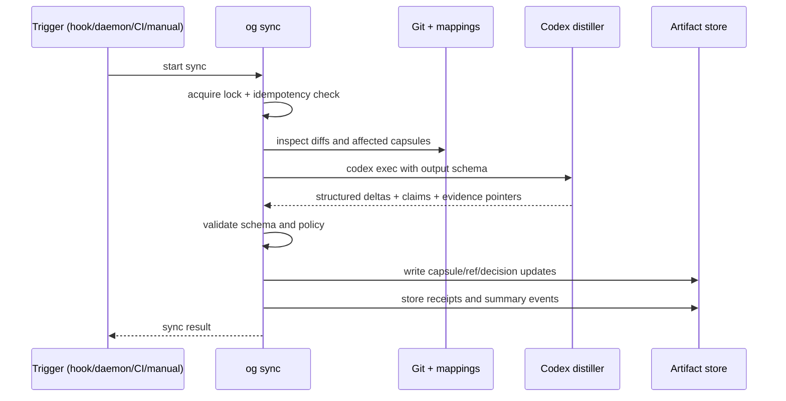
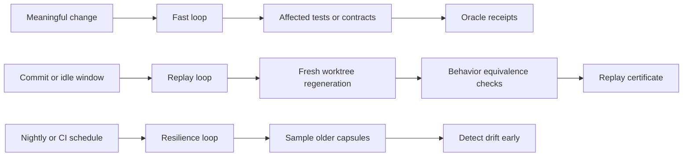
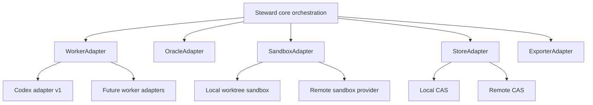
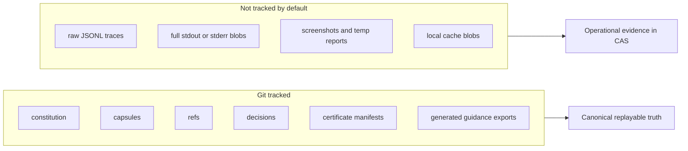
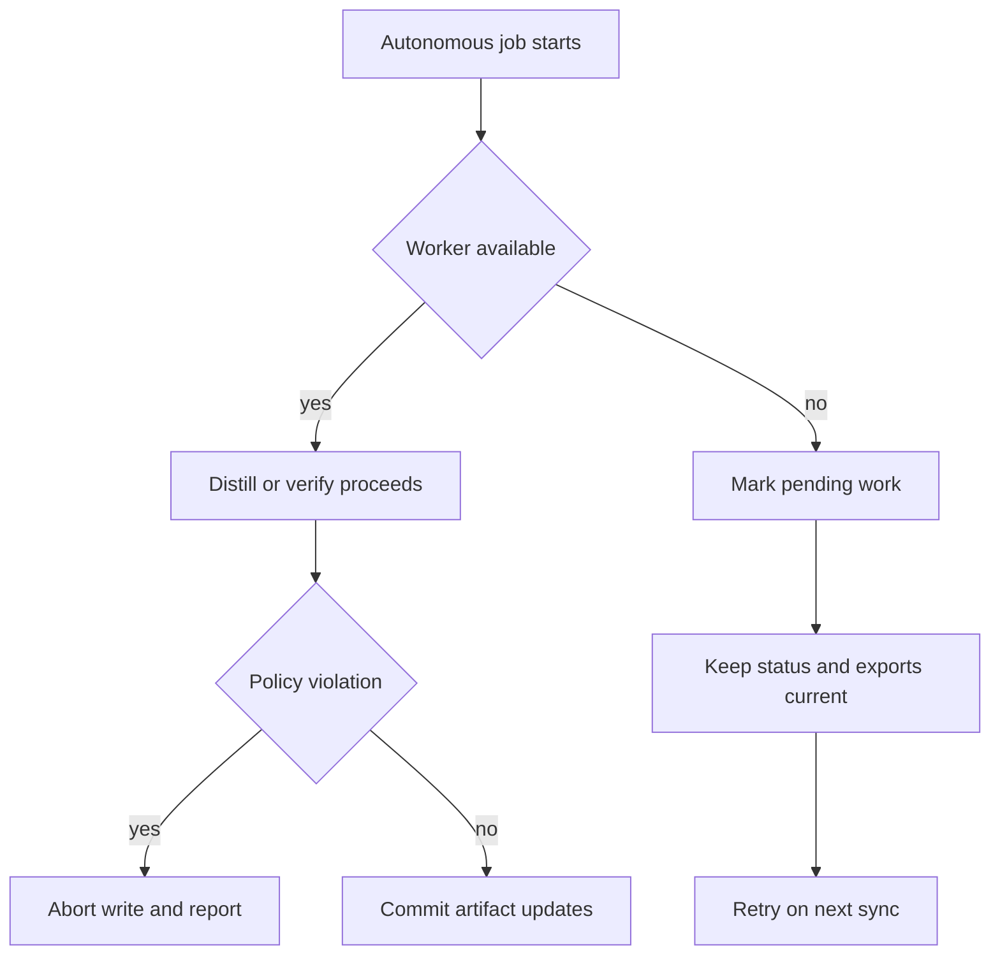

# Architecture - OutcomeGraph and Steward

Canonical spec: [SPEC-v2.md](./SPEC-v2.md)

This document explains how OutcomeGraph works as a Git-native artifact graph, and how Steward keeps it synchronized in the background.

## 1) System overview

OutcomeGraph is the canonical artifact model in the repo.
Steward is the sidecar runtime that continuously updates and verifies that model.
`og` is the stable CLI contract used by humans, agents, CI, and MCP clients.

## 2) Bounded contexts (DDD)

The system is split into clear contexts so components can evolve independently.

## 3) Core runtime loop (`og sync`)

All autonomous entrypoints (hooks, daemon, CI) compile to one command: `og sync`.
This keeps locking, dedupe, policy, and safety in one place.

## 4) Distillation flow (Codex v1 adapter)

Codex is the first worker runtime, but it is behind the `WorkerAdapter` interface.

## 5) Verification and replay loops

Verification is continuous, not a final ceremony.

## 6) Plugin architecture and portability

Adapters make the system future-proof across workers, oracle engines, and sandbox providers.

## 7) Data boundaries (tracked vs not tracked)

The repo tracks compact replayable truth. Bulky runtime exhaust is kept out of Git by default.

## 8) Safety and degraded operation

Default mode is safe-by-default (`observe`):

- automatic writes are limited to OutcomeGraph artifacts and configured exports
- product code edits require explicit broader mode
- failures in worker runtime degrade to pending state, not workflow blockage

## 9) Operational touchpoints

- Human path: `og init`, optional `og autopilot init`, then `og sync`.
- Agent path: use steward skill, run the same CLI contract.
- CI path: trigger `og sync`, `og verify --changed`, `og replay --changed` per policy.

This keeps one architecture across local development, automation, and multi-agent environments.
